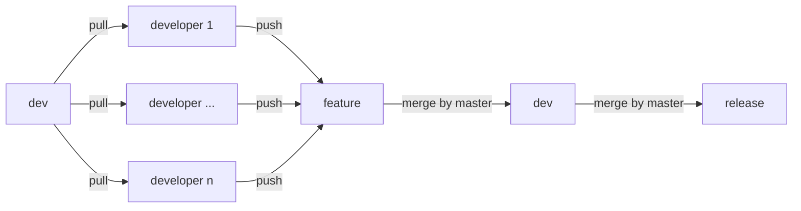
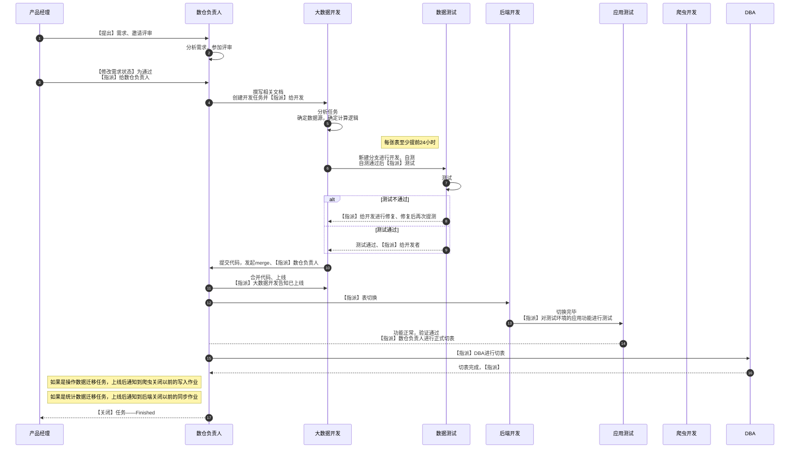
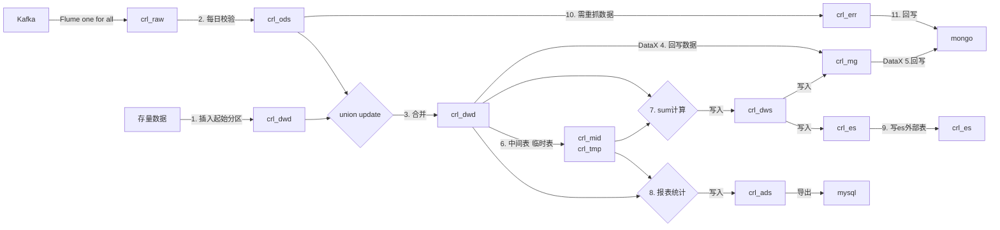
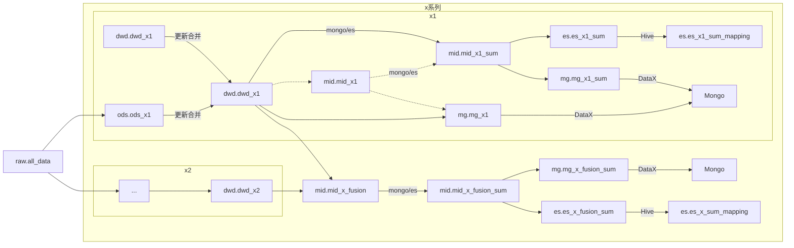
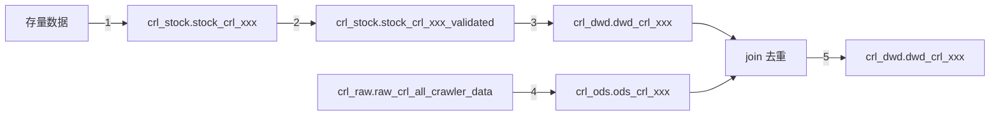

# 一、项目说明

## 1. 项目分支

### 1.1 dev

开发分支

### 1.2 release

发布分支

## 2. 项目结构

```
├── bin                                                  -- 可执行脚本目录
├── conf                                                 -- 配置目录
│   ├── datax                                        -- DataX相关配置目录
│   │   ├── config                               -- DataX`作业配置生成器`的配置文件目录
│   │   ├── datasource                           -- DataX`作业配置生成器`的配置文件所引用的`DataSource`目录
│   ├── flume                                      -- Flume作业配置目录
│   ├── hive                                       -- 数仓相关配置目录
│   └── template                                   -- 模板文件
│       ├── datax                                    -- DataX相关模板
│       ├── flume                                    -- Flume相关模板
│       └── hive                                     -- Hive相关模板
│   ├── validation                                 -- 数据校验相关配置目录
├── docs                                                 -- 文档
├── launch-pad                                           -- 上线区域
│   ├── ${project}                                   -- 项目名称
├── requirements.txt                                     -- 项目需要的Python包
├── workspace                                            -- 工作区域
└── lxy                                                  -- Python项目文件
```

## 3. 脚本用途与说明

- [datax-job-config-generator.py](bin/datax-job-config-generator.py)

  DataX作业配置文件生成器，更加详细的说明请查看脚本。
- [datax-job-monitor.sh](bin/datax-job-monitor.sh)

  DataX作业监控，分布式并行化作业发布后，每隔一段时间监控一次作业状态，待作业都结束后，查看作业的日志文件，判断有无失败作业，并告警，更加详细的说明请查看脚本。
- [datax-multiple-hive-job-starter.py](bin/datax-multiple-hive-job-starter.py)

  DataX 任意源到hive多作业启动脚本，内部调用[datax-multiple-mysql-job-starter.py](bin/datax-multiple-hive-job-starter.py)，方便进行远程调试。
- [datax-multiple-hive-job-starter.sh](bin/datax-multiple-hive-job-starter.sh)

  DataX 任意源到hive多作业启动脚本，更加详细的说明请查看脚本。
- [datax-multiple-job-starter.py](bin/datax-multiple-job-starter.py)

  DataX多作业启动器，内部调用[datax-multiple-job-starter.sh](bin/datax-multiple-job-starter.sh)，方便进行远程调试。
- [datax-multiple-job-starter.sh](bin/datax-multiple-job-starter.sh)

  DataX作业配置生成器配置文件生成器，更加详细的说明请查看脚本。
- [datax-gc-generator.py](bin/datax-gc-generator.py)

  DataX mysql到hdfs的作业配置生成器的配置文件生成器，通过读取MySQL Schema来自动生成`.ini`文件，更加详细的说明请查看脚本。
- [datax-single-job-starter.py](bin/datax-single-job-starter.py)

  DataX单作业启动脚本，内部调用[datax-single-job-starter.sh](bin/datax-single-job-starter.sh)，方便进行远程调试。
- [datax-single-job-starter.sh](bin/datax-single-job-starter.sh)

  DataX单作业启动脚本，更加详细的说明请查看脚本。
- [flume-control.sh](bin/flume-control.sh)

  Flume启动、停止、状态、重启、查看日志脚本，更加详细的说明请查看脚本。
- [hdfs-wait-exist.sh](bin/hdfs-wait-exist.sh)

  循环判断HDFS目录或文件是否存在，更加详细的说明请查看脚本。
- [hive-create-table-ddl-generator.py](bin/hive-create-table-ddl-generator.py)

  通过json配置文件生成stock、ods、dwd层建表语句（无注释）。
- [hive-exec.sh](bin/hive-exec.sh)

  通过Hive执行SQL语句或文件，hiveconf简化为c，hivevar简化为v，内置kinit。
- [hive-ods-dwd-full-update-starter.py](bin/hive-ods-dwd-full-update-starter.py)

  基于Hive on mr/Spark的ODS到DWD增量SQL自动生成并执行，更加详细的说明请查看脚本。
- hive-raw-ods-validation-multiple-starter.sh

  基于Hive on mr/Spark的支持并行、串行、随机Worker的raw-ods数据校验脚本。
- [hive-raw-ods-validation-starter.py](bin/hive-raw-ods-validation-starter.py)

  基于Hive on mr/Spark的RAW到ODS自动校验脚本，更加详细的说明请查看脚本。
- [hive-stock-validation-starter.py](bin/hive-stock-validation-starter.py)

  基于Hive on mr/Spark的存量数据自动校验脚本，更加详细的说明请查看脚本。
- [schema-compare.py](bin/schema-compare.py)

  比较源表与Hive表结构差异的脚本，目前仅实现了MySQL。
- [spark-ods-dwd-full-update-starter.py](bin/spark-ods-dwd-full-update-starter.py)

  基于Spark-SQL的ODS到DWD增量SQL自动生成并执行，更加详细的说明请查看脚本。
- [spark-raw-ods-validation-starter.py](bin/spark-raw-ods-validation-starter.py)

  基于Spark-SQL的RAW到ODS自动校验脚本，更加详细的说明请查看脚本。
- [spark-sql-starter.py](bin/spark-sql-starter.py)

  Spark-SQL执行器。
- [spark-stock-validation-starter.py](bin/spark-stock-validation-starter.py)

  基于Spark-SQL的存量数据自动校验脚本，更加详细的说明请查看脚本。

- [wechat-work-alert.sh](bin/wechat-work-alert.sh)

  企业微信机器人告警脚本，更加详细的说明请查看脚本。

# 二、分支合并流程



# 三、数据开发业务流程



# 四、数仓分层（旧架构、Apache集群）


# 五、数仓分层（新架构、CDH集群）

## 5.1 流程图



注：mid、tmp的区别

- mid是只被一个线性需求使用到的、需要保留以便查验的中间表
- tmp是在一次计算后生命周期就完结的或其他临时性统计需求的处理过程中使用到的表

注意：新架构日分区字段格式为yyyyMMdd

## 5.2 示例图




# 六、数据开发流程（CDH集群）

## 6.1 流程图及阶段说明



步骤（假定1-7步骤在T日执行，后续步骤在T+1日执行）：

1. 根据爬虫数据结构编辑作业配置，可参考[job-config-template](conf/template/validation/job-config-template.json)，对于主键的确认，可从wiki中查找，并向相关同事确认。

2. 建立与老集群DWD层表结构一致的临时表，例如：tmp.zgl_xxxx

3. 使用脚本[hive-create-table-ddl-generator.py](bin/hive-create-table-ddl-generator.py)生成的存量表、存量校验结果表、ODS表、DWD表的DDL。

    ```shell
    bin/hive-create-table-ddl-generator.py -c=conf/validation/xxx.json
    ```
- 存量表建表时，要确认数值字段，要与爬虫投递的数据类型一致，例如int、bigint，主要原因是如果对这些数值类型进行校验，而表创建却创建为string，会因为json里的类型是string而无法通过校验；

    - 对于python的python_json_object_string方法，不建议使用，因为会造成类型丢失，假设col的值有abc和123，123会作为int放入json字符串内，如果字段col的校验规则是string，最终字段值为123的不会通过校验，结果是{"col":"123 is not a string"}。

4. 将存量数据从mongo（不建议）或新集群拉到CDH（手动）——参考目录[mongo-hdfs](conf/datax/config/mongo-hdfs)下的文件。

    - mongo方式
      
        ```shell
        bin/datax-single-job-starter.sh -gc=your-generator-config.ini
        ```

    - 老集群方式

      ```shell
      # 老集群执行
      hadoop fs -get /warehouse/dwd/xxxx/dt=(T-1) /data1/export-data/zgl/xxxx/
      # 新集群执行
      cd ${HOME}
      scp -r -P40022 root@10.2.3.206:/data1/export-data/zgl/xxxx .
      hadoop fs -put xxxx/* /user/hive/warehouse/tmp.db/zgl_xxxx/
      rm -rf xxxx
      # 老集群执行
      rm -rf /data1/export-data/zgl/xxxx/
      ```

5. 将tmp表里的数据按照sotck表的顺序插入，对非字符串类型进行类型转换，恢复与爬虫数据类型、格式一致的状态

    ```sql
    INSERT INTO crl_stock.stock_crl_xxxx
    SELECT ....
      FROM tmp.zgl_xxxx
    ```

6. 对存量数据进行校验（也可以不校验直接进入DWD T-1分区）

    - 存量表建表时，要确认数值字段，要与爬虫投递的数据类型一次，例如int、bigint，主要原因是如果对这些数值类型进行校验，而表创建却创建为string，会因为json里的类型是string而无法通过校验；

    - 对于python的python_json_object_string方法，不建议使用，因为会造成类型丢失，假设col的值有abc和123，123会作为int放入json字符串内，如果字段col的校验规则是string，最终字段值为123的不会通过校验，结果是{"col":"123 is not a string"}。
   
7. 将存量数据从mongo（不建议）或新集群拉到CDH（手动）——参考目录[mongo-hdfs](conf/datax/config/mongo-hdfs)下的文件。

    - mongo方式
      
        ```shell
        bin/datax-single-job-starter.sh -gc=your-generator-config.ini
        ```

    - 老集群方式

      ```shell
      # 老集群执行
      hadoop fs -get /warehouse/dwd/xxxx/dt=(T-1) /data1/export-data/zgl/xxxx/
      # 新集群执行
      cd ${HOME}
      scp -r -P40022 root@10.2.3.206:/data1/export-data/zgl/xxxx .
      hadoop fs -put xxxx/* /user/hive/warehouse/tmp.db/zgl_xxxx/
      rm -rf xxxx
      # 老集群执行
      rm -rf /data1/export-data/zgl/xxxx/
      ```

8. 将tmp表里的数据按照sotck表的顺序插入，对非字符串类型进行类型转换，恢复与爬虫数据类型、格式一致的状态


    ```sql
    INSERT INTO crl_stock.stock_crl_xxxx
    SELECT ....
      FROM tmp.zgl_xxxx
    ```

9. 对存量数据进行校验（也可以不校验直接进入DWD原始分区）


    - 基于Hive on MR/Spark
    
        ```shell
        bin/hive-stock-validation-starter.py -c=${config} -e=${engine}
        ```
        
    - 基于SparkSQL
    
        ```shell
        bin/spark-stock-validation-starter.py -c=${config}
        ```

10. 将校验后的存量数据中有效的数据写入DWD T-1分区——目前手动。

    ```sql
    INSERT OVERWRITE TABLE ${dwd_table} PARTITION (dt=${T-1})
    SELECT create_date,update_date,'old' as record_status,<pk_fields>,<other_fields>
      FROM ${validated_stock_table}
     WHERE valid
    ```

11. 校验爬虫数据总表指定数据（dt=T，key=xxxx）并写入ODS

    - 基于Hive on MR/Spark——使用脚本[hive-raw-ods-validation-starter.py](bin/hive-raw-ods-validation-starter.py)

        ```shell
        bin/hive-raw-ods-validation-starter.py -c=${config} -dt=${dt} -e=${engine}
        ```

    - 基于SparkSQL——使用脚本[spark-raw-ods-validation-starter.py](bin/spark-raw-ods-validation-starter.py)

        ```shell
        bin/spark-raw-ods-validation-starter.py -c=${config} -dt=${dt}
        ```

12. 调度：将DWD T-1分区的数据与ODS T分区的数据进行JOIN去重，写入DWD的T分区（dolphin上有模板）

    - 基于Hive on MR/Spark——使用脚本[hive-ods-dwd-full-update-starter.py](bin/hive-ods-dwd-full-update-starter.py)。
    
        ```shell
        bin/hive-ods-dwd-full-update-starter.py -c=${config} -dt=${dt} -e=${engine}
        ```

    - 基于SparkSQL——使用脚本[spark-ods-dwd-full-update-starter.py](bin/spark-ods-dwd-full-update-starter.py)。

        ```shell
        bin/spark-ods-dwd-full-update-starter.py -c=${config} -dt=${dt}
        ```

校验UDF开发说明：

1. 支持的UDF必须包含三部分（如下图所示）：


- 方法名称为：verify_int
- 方法的第一个参数为字符串数组：`["amountNumber","jobType","salaryNumber"]`
- 方法的第二个参数为完整的待校验数据：`json_object: Dict[str, any]`

2. 测试你的UDF，见文件[validation_udf_tester.py](lxy/validation/tester/validation_udf_tester.py)。

## 6.2 作业配置详解

示例可见[job-config-template.json](conf/template/validation/job-config-template.json)。

- desc

  字符串，对该数据集的描述，会被用作建表语句的注释。

- stock_table

  字符串，存量数据表的名称，放在crl_stock数据库，表名以stock_crl开头。

- stock_validated_table": "crl_stock.stock_crl_tax_abnormal_validated

  字符串，存量数据校验结果表的名称，一般放在crl_stock数据库，以stock_crl开头，以_validated结尾。

- raw_table

  字符串，原始数据表，使用crl_raw.raw_crl_all_crawler_data，不用更改（另有一张爬虫的测试数据表crl_raw.raw_crl_test_crawler_data）。

- ods_table

  字符串，ODS层数据表名称，放在crl_ods数据库，表名以ods_crl开头。

- dwd_table

  字符串，DWD层数据表名称，放在crl_dwd数据库，表名以dwd_crl开头。

- stock_config

  存量数据校验的配置。

    - stock_fields

      数组，指存量数据表参与校验的字段，与`stock_json_keys`一一对应。

    - stock_json_keys

      数组，指将存量数据字段`stock_fields`以什么别名组成一个json对象字符串（与爬虫数据结构一致）。

    - stock_json_field

      字符串，组成的JSON字段命名，一般为`fields`不用更改。

    - stock_where

      数组，如果存量数据过大，可以分拆为几个分区，通过传递该参数来达到分治的目的。

    - stock_task_partitions

      整型，存量数据校验的repartition个数，必传。

    - stock_result_partitions

      整型，存量数据校验结果的repartition个数，必传。

    - stock_hive_conf

      json对象，使用Hive on mr/Spark进行存量数据校验时以key-value形式自定义Hive参数。

    - stock_spark_conf

      json对象，使用Spark-SQL进行存量数据校验时以key-value形式自定义Spark参数。

- raw_ods_config

  RAW-ODS数据校验的配置。

    - raw_json_field

      字符串，原始数据字段名称，一般为fields（crl_raw.raw_crl_all_crawler_data中的fields）不用改。

    - raw_json_keys

      数组，`raw_json_field`中的字段，字段请按`抓取时间`、`主键`、`其他普通字段`的顺序排列。

    - dt

      字符串，日期参数，格式为yyyyMMdd[-|-yyyyMMdd]，其优先级小于命令行传入的日期，大于默认日期（昨日）。

    - topic

      字符串，Kafka topic，可在文件[topic-key-mapping.xlsx](conf/flume/topic-key-mapping.xlsx)找到你要找的值。

    - key

      字符串，Kafka key，可在文件[topic-key-mapping.xlsx](conf/flume/topic-key-mapping.xlsx)找到你要找的值。

    - ods_fields

      数组，ODS层表的字段（除valid、validate_desc放在第1、2位外的其他字段），与raw_json_keys顺序一致。

    - raw_task_partitions

      整型，RAW-ODS数据校验的repartition个数，必传。

    - ods_result_partitions

      整型，RAW-ODS数据校验结果的repartition个数，必传。

    - raw_ods_hive_conf

      json对象，当使用Hive on mr/Spark进行RAW-ODS数据校验时以key-value形式自定义Hive参数。

    - raw_ods_spark_conf

      json对象，使用Hive on mr/Spark进行RAW-ODS数据校验时以key-value形式自定义Spark参数。

- ods_dwd_config

  ODS-DWD增量数据合并后全量存储的配置。

    - pk_fields

      数组，主键字段。

    - other_fields

      数组，除`主键`、`抓取时间`外的其他要更新的字段。

    - time_field

      字符串，抓取时间，一般为crawler_time不用改.

    - dt

      字符串，日期参数，格式为yyyyMMdd[-|-yyyyMMdd]，其优先级小于命令行传入的日期，大于默认日期（昨日）。

    - valid_expr

      字符串，有效数据筛选的表达式，一般为valid不用改.

    - converted_ods_fields

      json对象，表示ods层数据真实的数据类型，如`"release_date": "BIGINT"`。

    - ods_dwd_result_partitions

      整型，ODS-DWD数据合并的repartition个数，必传。

    - ods_dwd_hive_conf

      json对象，使用Hive on mr/Spark进行ODS-DWD数据合并时以key-value形式自定义Hive参数。

    - ods_dwd_spark_conf

      json对象，使用Hive on mr/Spark进行ODS-DWD数据合并时以key-value形式自定义Spark参数。

- command

  Hive非Java UDF的解释器或执行器，目前使用`/usr/bin/python3`不用改。

- validator

  Hive非Java校验器文件，目前使用`lxy/validation/validator/json_schema_validator_hive.py`不用改。

- constraint

  json对象，json模式校验定义，鸟哥专长。

- custom_function

  json对象，数组自定义校验方法，对象的key是方法名，value是自定义校验方法的第一个参数，第二个参数是完整的待校验的数据（Dict）。

- validation_udf_files

  数组，使用Hive on mr/Spark进行数据校验时自定义校验方法的脚本文件，除`lxy/validation/udf/common_udf.py`
  外可以在其他文件按开发者、按某种类型分组进行UDF的开发，便于分类查找和支持多人开发，互相之间方法命名有冲突也不会影响整个功能。

- spark_udf_files

  数组，使用Spark-SQL进行数据校验时自定义校验方法的脚本文件，必须引用的是`lxy/validation/validator/json_schema_validator_spark.py`，其他UDF文件请按需引用。

# 七、场景举例

## 7.1 MySQL数据导入Hive

### 7.1.1 常规流程

- 准备好要读取的MySQL的host、port、username、password、database

- 在开发环境或服务器上运行`bin/datax-gc-generator.py`，并传递以下参数（可参考`conf/datax/gocg`下的脚本）

  ```shell
  bin/datax-gc-generator.py \
  	-h=${host} \
  	-P=${port} \
  	-u=${username} \
  	-p=${password} \
  	-D=${database} \
  	-t=${table-1} \         -- 如果要导出的只是少量表，建议显式指定你需要哪些表
    -t=${table-2} \
    -tr=${table regex} \    -- 如果需要的表有一定规则，可以提供正则来进行筛选
  	-e=${exclude-table-1} \ -- 如果有少数表不导出，建议显式指定哪些表不到处
    -e=${exclude-table-2} \
    -er=${exclude regex} \  -- 如果不要的表有一定规则，可以通过正则来进行排除
  	-project=${project} \
  	-layer=${layer} \       -- layer为ods可不传
  	-env=${env} \           -- env用来区分生产环境和测试环境，生产环境建议不传env
  	-partitioned      	    -- 建议始终保留此项，除非你确定没有一个表是分区的
  ```

- 一般来说，除非你通过`-output`
  指定了DataX作业生成器配置文件生成器的输出路径（有点拗口，就是两层生成器，第一层读取MySQL的schema数据，生成ini文件，第二层读取ini文件，生成DataX最终用的json文件），否则你可以在`ignored`文件夹下发现刚生生成的`.ini`文件。
  
- 将`.ini`文件下载下来后，确定每个表是否是分区表，如果不是，将`writer`里的`path`中的`${dt}`去掉。

  

- 将你不需要导出的表的`.ini`文件直接删除，在`conf/datax/config/mysql-hdfs`下建立一个格式为`${project}-${layer}[-${env}]`格式的文件夹，并将确定使用的`.ini`
  文件放进去，假设你创建的文件夹叫`pjt-ods`。

- 测试导出

  ```shell
  bin/datax-multiple-mysql-hive-job-starter.sh \
  	--override \  -- 注意一定要传
  	-gcd=conf/datax/config/mysql-hdfs/pjt-ods
  ```

- 发布

  ```shell
  # 修改bin/datax-multiple-mysql-hive-job-starter.sh
  # 在变量`partitioned_tables`里加入要创建分区的表（未能自动解析的）
  # 在变量`generator_config_directory_array`里加入`conf/datax/config/mysql-hdfs/pjt-ods`
  ```


# 八、命令

## 7.1 MongoDB

- 创建索引

  ```
  db.{COLLECTION}.createIndex({"FIELD1":1,"FIELD2":1,"FIELD3":1})
  ```

- 删除索引

  ```
  db.{COLLECTION}.dropIndex("PID_1_NAME_1")
  ```

- 修改表名

  ```
  ```

- 预留


## 7.2 HDFS

```
# 修复租约
hdfs debug recoverLease -retries 10 -path ${path}
# 筛选10MB以下小文件
hadoop fs -du -h /user/hive/warehouse/crl_dwd.db/*/dt=*/* | grep -Ev "G|_SUCCESS" | grep "    " | sed "s/ M/M/g;s/ K/K/g" | sort -hr -k 1 -t " "
```

